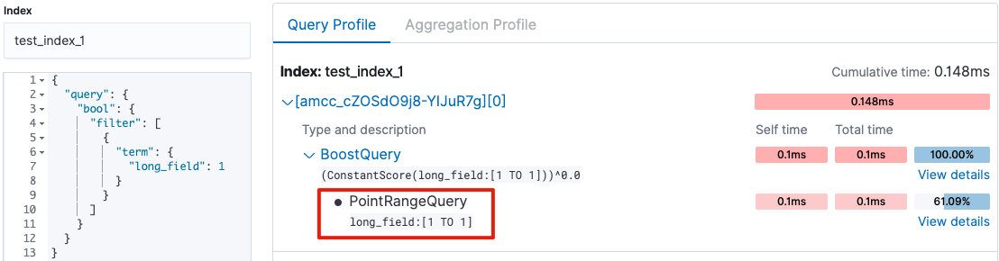
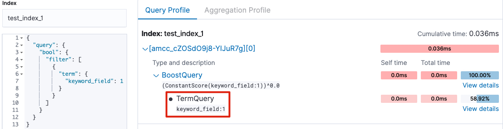
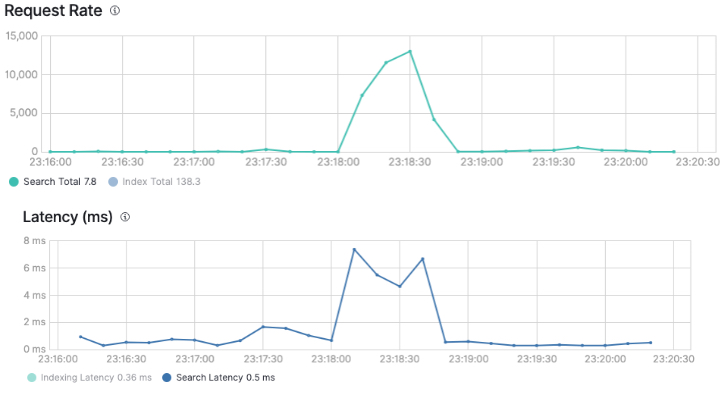
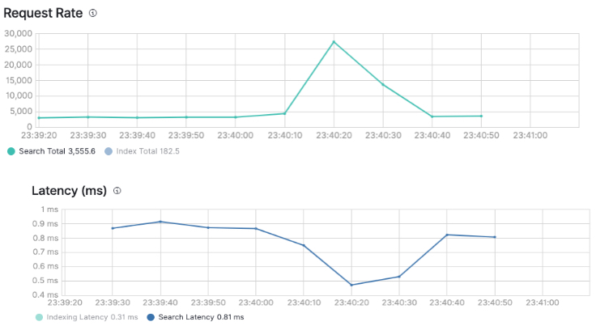
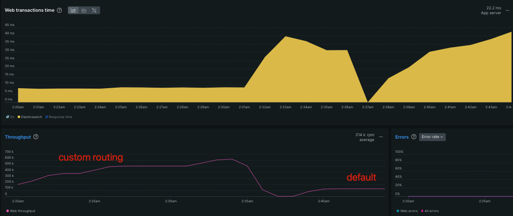

# Elasticsearch Notes
- [Using a Numeric Identifier as a Keyword Mapping](#using-a-numeric-identifier-as-a-keyword-mapping)
- [Use custom Routing value](#use-custom-routing-value)
- [Don't use _id field for sorting](#dont-use-_id-field-for-sorting)

## Using a Numeric Identifier as a Keyword Mapping
If you are going to apply a term query to a field consisting of numbers, keeping that field as a Keyword rather than an Integer can significantly improve your query performance. Depending on your needs, you can keep the same field both as an Integer and as a Keyword. When applying a term query, you should use the field mapped with Keyword, while for a range query, you should use the field mapped with Integer. Elasticsearch also recommends this approach on its website as follows:

>Mapping numeric identifiers
>
>Not all numeric data should be mapped as a  [numeric](https://www.elastic.co/guide/en/elasticsearch/reference/current/number.html "Numeric field types")  field data type. Elasticsearch optimizes numeric fields, such as  `integer` or  `long`, for  [`range`](https://www.elastic.co/guide/en/elasticsearch/reference/current/query-dsl-range-query.html "Range query")  queries. However,  [`keyword`](https://www.elastic.co/guide/en/elasticsearch/reference/current/keyword.html "Keyword type family")  fields are better for  [`term`](https://www.elastic.co/guide/en/elasticsearch/reference/current/query-dsl-term-query.html "Term query")  and other  [term-level](https://www.elastic.co/guide/en/elasticsearch/reference/current/term-level-queries.html "Term-level queries")  queries.  
>Identifiers, such as an ISBN or a product ID, are rarely used in  `range` queries. However, they are often retrieved using term-level queries.  
Consider mapping a numeric identifier as a  `keyword` if:
>- You don’t plan to search for the identifier data using  [`range`](https://www.elastic.co/guide/en/elasticsearch/reference/current/query-dsl-range-query.html "Range query")  queries.
>- Fast retrieval is important.  `term` query searches on  `keyword` fields are often faster than  `term` searches on numeric fields.
>
> If you’re unsure which to use, you can use a  [multi-field](https://www.elastic.co/guide/en/elasticsearch/reference/current/multi-fields.html "fields")  to map the data as both a  `keyword`  _and_ a numeric data type.

For example, when we profile the terms query applied to fields indexed as both Keyword and Integer, we can see that the query for the Integer field uses PointRangeQuery, while the query for the Keyword field uses TermQuery.

| long                              | keyword                           |  
|-----------------------------------|-----------------------------------|  
|  |  |  

The benefits of using Keyword instead of Integer can be easily observed under load. For example, when we send a small amount of traffic to an index containing 500 million documents, we can see how the search latency increases as follows:

| long                                      | keyword                                   |  
|-------------------------------------------|-------------------------------------------|  
|  |  |

## Use custom Routing value

In Elasticsearch, a shard is a partition of an index. Elasticsearch splits large indices into smaller pieces to store and search data in a scalable and distributed manner. Each shard functions as an independent search engine with its own indexing and search capabilities.

When Elasticsearch indexes or retrieves a document, it decides which shard to use with the following formula:

    shard = hash(routing) % number_of_primary_shards

The routing value is an arbitrary string, which defaults to the document’s _id but can also be set to a custom value.

### Fetch a Document

To fetch a document by its _id in Elasticsearch, the following steps occur:

1.  The request is sent from the client to a random node in the cluster, for example, node_1.
2.  Node_1 uses the _id to determine which shard the document is indexed in, using the formula
    `shard = hash(_id) % number_of_primary_shards`.
3.  Node_1 forwards the request to the node that holds the relevant shard, for example, node_5.
4.  Node_5 retrieves the requested document and returns it to node_1.
5.  Node_1 then sends the document back to the client as the response.

### Search Execution

Searching demands a more intricate execution model as it's uncertain which documents will match the query, potentially scattered across any shard within the cluster. To determine if there are any matching documents, a search request must check a replica of each shard in the index or indices of interest.

Search is executed in a two-phase process called **query** then **fetch**.

In Elasticsearch, the query process unfolds as follows:

1.  The request is initiated from the client and directed to a random node, for instance, node_1.
2.  Node_1 forwards the search request to all shards within the cluster.
3.  Each shard conducts its search independently, sorts the results, and returns the _id information of the desired number of documents to node_1.
4.  Node_1 consolidates and sorts the _id and score information received from all shards.
5.  Subsequently, the **fetch** step begins for the desired number of _id.
---
Understanding the search process in Elasticsearch, it's clear that the search operation needs to be executed across all shards because we don't know which shard contains the document we're looking for. Therefore, making a single search request to Elasticsearch actually generates as many search requests as the number of shards in the cluster. This implies that increasing the number of shards may not directly increase the search capacity of our Elasticsearch cluster.

For example, suppose you have an encyclopedia set in your library and you want to look up the meaning of a word. Instead of searching through the entire encyclopedia set, you only need to search in the relevant volume because it is organized alphabetically by volumes based on the initial letter of the word. The importance of routing in Elasticsearch is similar. For instance, if you route based on a field that receives heavy queries, you can efficiently locate the relevant shard and conduct the search only within that shard, rather than querying all shards. This makes the search process more efficient and ensures more effective utilization of resources. By employing this method, you can increase the search capacity of your Elasticsearch cluster by a factor equal to the number of shards.

We sent load to our Elasticsearch index, which contains 500 million documents, with 6 shards and 0 replicas, at a rate of 125k requests per minute, achieving response times of 35-40ms. By indexing based on a specific field and routing queries to that field, we were able to obtain response times of 12ms at a load of 500k requests per minute.

For example, the following indexing request routes a document using `nike`.

	PUT products/_doc?routing=nike 
    {
      "brand": "nike",
      "name": "air max"
    }

For example, the following indexing request routes a document using `nike`.

    GET products/_search?routing=nike
    {
      "query": {
        "bool": {
          "filter": [
            {
              "term": {
                "name": "air max"
              }
            }
          ]
        }
      }
    }

## Don't use _id field for sorting
In Elasticsearch, if you are using Point in Time (PIT), it is recommended to use **_shard_doc** as the tie breaker.

Using the **_id** field for sorting, aggregations, and scripting in Elasticsearch is not recommended because the **_id** field is not **doc_values** and is not stored on disk. Consequently, sorting by **_id** caches these values in memory, increasing heap usage. If you do not have another unique field for sorting, you can duplicate the **_id** field in your mapping as a regular field and use that instead. You can check the size of the field cache in Elasticsearch with the following command: `GET /_cat/fielddata?v=true`. Afterward, don't forget to clear the field data caches.

For more detailed information
- [doc_values](https://www.elastic.co/guide/en/elasticsearch/reference/current/doc-values.html)
- [fielddata](https://www.elastic.co/guide/en/elasticsearch/reference/current/text.html#fielddata-mapping-param)
- [_id field](https://www.elastic.co/guide/en/elasticsearch/reference/current/mapping-id-field.html)
